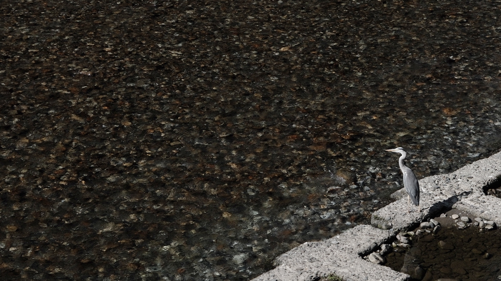

+++
date = '2026-07-20T18:39:33+09:00'
draft = false
title = '一千年前的风——熊野古道记事'
+++

决定在7月独自出发去熊野古道，并不是一件容易做的决定。但跟过去无数次类似的决定一样，我往往不会给自己后悔的时间，便预约了最近一趟有空位的航班。

南纪白滨，是和歌山机场的名字，颇具江户之美的名字。我一直狭隘地以为那地界会是大山套小山，没想到落地后乘bus往田边开的大半程里，都是碧海蓝天，椰树沙滩，海风的咸湿仿佛能穿透车窗扑面而来，”白滨“二字诚不我欺。

于是我只好拉上了窗帘屏蔽掉了这份过载的浪漫，毕竟独行之人，稳固道心的最佳方案在“吃苦”，而非“度假”。

好在车头转过最后一轮海湾后，道路尽头终于只剩连绵的山。我拉开窗帘，终于瞥到山腰出现一副指示牌——熊野三山，它到了。

虽然知道7月是全年最淡季，但还是没料到半车登山客里，就我一人拎着行李孤零零地在滝尻登山口下了车 ，同车几个欧美背包客，在稳坐钓鱼台的同时，朝我递来了“god bless you”的眼神，让我隐隐有些担心。

已经接近正午。今天不仅有14km的任务，还务必在目的地所有商店关门——也就是五点半之前到达为次日补给。我不敢耽搁，迅速调整了背包肩带，便踏入滝尻神社。这是2026年7月10号，周五，31度，负重9kg，包括2L水。

开头的连续爬升让人有些难受，暴汗的同时却提不起速度。不过我并不担心，路还足够长，开头越难越要稳固呼吸，缓步启动。跟我前后脚上来的还有两个轻装上阵的台湾男生，一边聊天一边悠闲前进，也逐渐和龟爬的我拉开了距离。好在翻过最难的山头抵达高原神社时，我的状态和速度都已回升，再次与在路边抽烟休息的他们相遇，听见他们用中文议论道 “这人背了这么大个包还爬挺快，应该是要走完全程吧。”  —— 看来他们本就计划点到为止。

和他俩分开后的3小时里，再没遇见过一个人。

此时路况已从山脊爬升，过渡到了森林腹地，偶尔会经过一两个村庄，却也不见人，只有临时的自助摊位解释着可以把硬币投入小盒子里，取些饮品装饰品自去。更路过一处，免费提供修鞋工具的牌子，让人不禁猜测，是千年前的行脚者，坐在田坎边修理草鞋后留下的遗风。

虽然习惯了一个人在户外活动，且对可能出现的熊蛇蚂蝗和暴雨，分别做了应对准备，但比原计划更长时间看不到人类这个问题，尤其对近两年泛滥的熊灾的担心，叫我愈发不安起来。我甚至开始奢望刚才那两位台湾男生，能心血来潮突然追上来，这次我一定用中文对他们报以热烈致意。在只有无尽的树林和小昆虫作伴的数小时里，整个世界安静地只剩下我的脚步，以及熊铃孤独却有节奏地叮铃叮铃。我没有心情喝水补给，只是本能地全速前进，盼望在前方不远处，能有人注意到身后由远及近的铃声，以作慰藉。

到了下午4点，林道进入了一天中最美最温柔的时段。明晃晃的太阳已斜照许久，金黄和葱绿盈透交错，湿气似乎被驱散，凉风带着草本香味抚过鼻尖。我看了眼手表，知道不久便是目的地了，这比预计的到达时间还早一些——我得以稍微卸下些心理负担。

脚步慢下来后，沉静辽阔的林间，虽然还是只有我一支熊铃声，但愈发轻快悠然。我想起这一路经过的几处“茶迹“，知道是当年真实存在过的，为路人提供方便的茶摊遗址，却不知这千年里独行的人，是否和今天的我一样有两难的困境？是从开始便抱有既来之则安之的从容，还是因为心里装的尽是风险应对之举，便没有多余的安全容量欣赏此方天地。虽然我脚下的每一步，都覆盖着过去一千年到访者的脚步，却无从知晓他们的答案。又或者，但这条历经千年未变的路的存在，本身就像是答案。

下午5点，我终于到达了近露村庄。民宿老板说作为敢在猛暑日还挑战熊野古道的——今天唯一的客人，我有权承包他所有的房间。这村子不大，却有一个美术馆，我赶在村上唯一还营业的饭店关门前，饱餐一顿。偌大的餐厅，连吃饭都只有我一桌客人。睡前我问老板，你们这儿有熊吗？老板拍着胸脯告诉我——没有熊，但有毒的蝮蛇倒是特产，随处可见。我一时不知该高兴还是担心。不过好歹算排除了一个隐患，那一晚，我睡得极好。

第二天计划24公里，虽然没有第一天连续爬升的痛苦，却有接近两倍的行脚任务。民宿老板早起为我做了份简单充实的早餐，走时用地道的中文说（他曾留学中国七年）“努力，加油，有缘，再见。”

2026年7月11日，早上7：30，28度。也许是我的身体适应了这种节奏，也可能是一上路就零星遇见了几位徒步者。我没有了前一天的心理负担，开始走走停停，频繁举起镜头，毫无顾虑地聚焦在风景上，有时都忘记了还有漫漫长路在前。

下午2点，我遇见了第一条蛇。它盘踞在路中心，当时我低头看轨迹，完全没注意到它，等距离不到一米时，它卷起黑绒绒滑溜溜的身子滕地立了起来，虽然没有攻击我，只是迅速向路边的墙壁滑去，最后消失在了灌木中。我惊慌中后退一大步，一边打开拇指相机记录，一边大呼——老板没有骗我！

不过半小时，又遇见第二条。这次我虽淡定通过，但之后更加集中注意力在脚边，不敢肆意拍摄了。
下午3点，我抵达了发心门王子。熊野古道上一个99个王子，其信仰融合了神道教，密教和佛教净土宗。而发心门，是进入阿弥陀佛本宫大社前最具标志性的一个王子，也是完整熊野古道中寓意进入极乐净土的“开端”——初发心时，便成正觉。如我般无法做到全踏破的人，凭此发心，应知毕竟二不别。

下午4点，最后3公里，也就一个小时左右的路程了。和我同时抵达发心门的欧美背包客，决定去等bus直通终点了。于是只剩我，踏上了最后这段，此时我脚上的大泡小泡都早已磨破，袜子黏在肉上，每踏一步都是煎熬，不知为何，明明之前几十公里都忍耐着过来了，偏偏在这最后一程上，痛苦像被无限放大了濒临我的忍受极限。手表记录我已经流失了将近11L汗水，整个人像从游泳池捞上来一样湿透，我怀疑我的登山鞋里能养鱼。

我看了手表不下上百次，明明已经下降到海拔200米的地方，却怎么也踏不到水泥路面上，我频繁怀疑自己走错了路，病开始有种元神出窍的分离感——听到身体在威胁大脑说“再不快走，天黑了蛇就出来咬你了。” 但大脑拒绝接收并回复一句“今天就算熊来了，老子都走不动了。” 我喝光了最后一口水，吃完了最后的补给，昨天熟悉的焦灼感又回来了，我在这份焦灼里，无数次调用对抵达温泉酒店后的豪华晚餐的憧憬，勉力前进。

2026年7月11日，下午5点，我终于走下了最后一级台阶，抵达了熊野本宫大社。这里没有我想象中的热闹，显得安静冷清。我已经没有力气拜访神社了，只有安静地坐在路边等车，

去酒店的车上，当地的司机老爷爷问我：是从哪儿走来的？ 听我回答后感叹：这个天气这么走来，真是不容易啊。然后真诚补刀道——话说你们东京是没山吗？要跑来这儿看山。

东京有山啊，东京也有山路啊。可一千年来几乎没变过的一条徒步之路，全世界只有两条，其中一条就在这儿。它见惯了千年里来往的旅人，却没有见过我。这一次，就算见过了，以后再来，无论还是独行与否，皆是重逢。